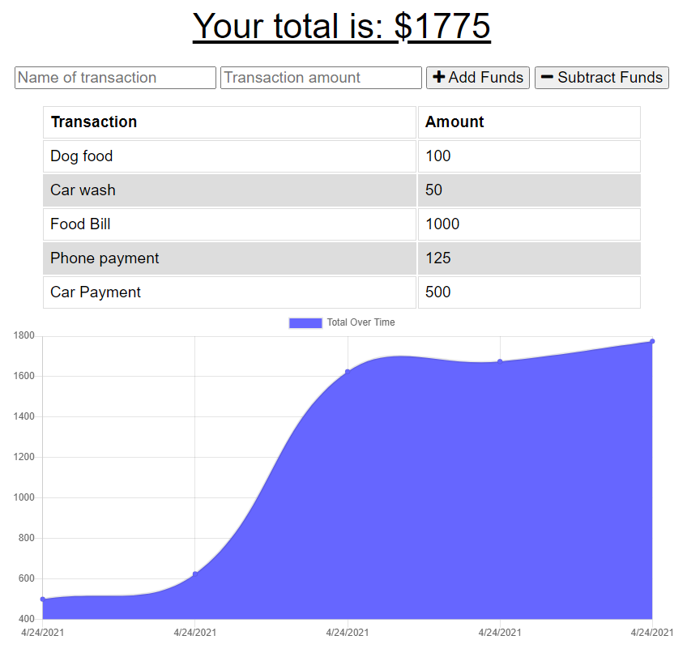

# BUDGET-TRACKER-Week-19-challenge
  

  ## Description
This PWA application allows users a fast and easy way to track their spending and income. Being a PWA, the app allows a user to access that information at any time, with or without online connectivity.
    
  * Link for Heroku deployment [Heroku](https://shielded-everglades-84342.herokuapp.com)    
  * Link for GitHub Repository [GitHub](https://github.com/a7063p/week-19-challenge.git)  

  ## Table of Contents
  * [Installation](#Installation)
  * [Usage](#Usage)
  * [License](#License)
  * [Languages](#Languages)  
  
  
  * [Questions](##Questions) 
  

  ## Installation
    This application is deployed to Heroku, please follow the above link to access. Additionally, if the user chooses to download the application; Please press "install app" icon in the upper right URL tool bar and follow the instructions.
    
  ## Usage
  This application utilizes service-workers and Index DB so it is fully functional with or without internet/cellular connection. If off-line, Index DB maintains all transactions entered locally. Once connectivity is re-established, the user will see an 'alert' notification that all stored data had been uploaded into the DB. This is done automatically and requires no additional effort on the users end.
      

    
  
  ## Languages  
    
    
    
    
    
    
      
      
      
      
 

  ## License
  
  
  This application currently is licensed with MIT. 
 

  

  ## Contribute
  Contributor privileges are open to ALL that want to positively contribute to this project

  
  

  ## Questions
  Please feel free to email me with any comments, questions or concerns at ap@ampiUSA.com

  [GitHub Account](https://github.com/a7063p)
